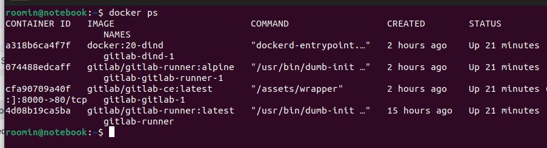
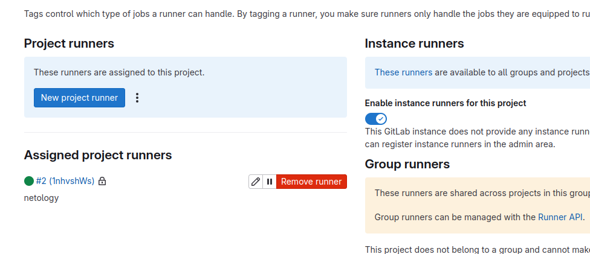
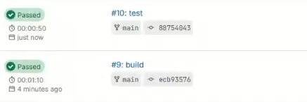

# Домашнее задание к занятию «GitLab»

### Задание 1
#### Что нужно сделать:

1. Разверните GitLab локально, используя Vagrantfile и инструкцию, описанные в этом репозитории.
2. Создайте новый проект и пустой репозиторий в нём.
3. Зарегистрируйте gitlab-runner для этого проекта и запустите его в режиме Docker. Раннер можно регистрировать и запускать на той же виртуальной машине, на которой запущен GitLab.
4. В качестве ответа в репозиторий шаблона с решением добавьте скриншоты с настройками раннера в проекте.

### Без впн как я понял он не поставится либо качать локально, либо через докер




### Задание 2
#### Что нужно сделать:

+ 1. Запушьте репозиторий на GitLab, изменив origin. Это изучалось на занятии по Git.
+ 2. Создайте .gitlab-ci.yml, описав в нём все необходимые, на ваш взгляд, этапы.

В качестве ответа в шаблон с решением добавьте:

файл gitlab-ci.yml для своего проекта или вставьте код в соответствующее поле в шаблоне;
скриншоты с успешно собранными сборками.

### Без впн как я понял он не поставится либо качать локально, либо через докер




```

stages:
  - test
  - build

test:
  stage: test
  image: golang:1.17
  script: 
   - go test .

build:
  stage: build
  image: docker:latest
  script:
   - docker build .

```

### Дополнительные задания* (со звёздочкой)
Их выполнение необязательное и не влияет на получение зачёта по домашнему заданию. Можете их решить, если хотите лучше разобраться в материале.

### Задание 3*
Измените CI так, чтобы:

+ этап сборки запускался сразу, не дожидаясь результатов тестов;
+ тесты запускались только при изменении файлов с расширением *.go.

В качестве ответа добавьте в шаблон с решением файл gitlab-ci.yml своего проекта или вставьте код в соответсвующее поле в шаблоне.