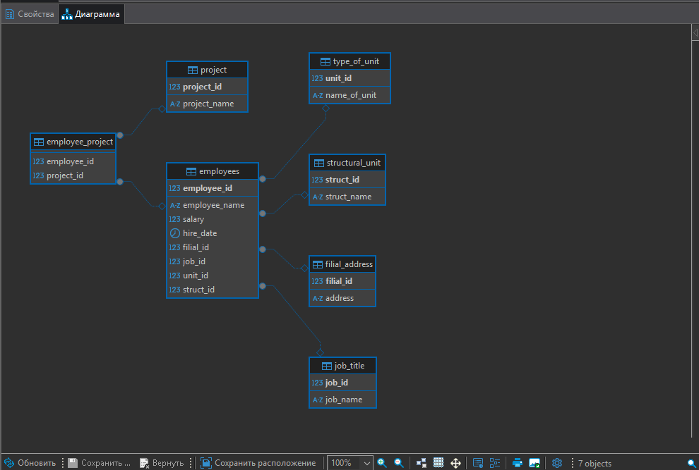

# ДДомашнее задание к занятию «Базы данных» - `Бутко Александр`

### Задание 1

Опишите не менее семи таблиц, из которых состоит база данных:

1. какие данные хранятся в этих таблицах;
2. какой тип данных у столбцов в этих таблицах, если данные хранятся в PostgreSQL.

Приведите решение к следующему виду:

Сотрудники (

1. идентификатор, первичный ключ, serial,
2. фамилия varchar(50),
3. ...
4. идентификатор структурного подразделения, внешний ключ, integer).

