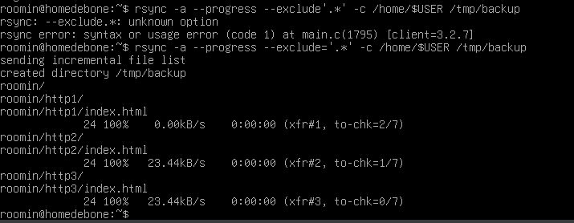
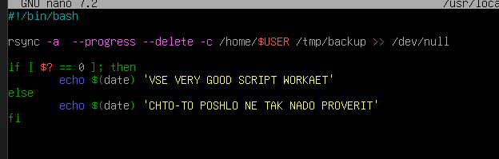
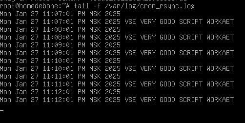
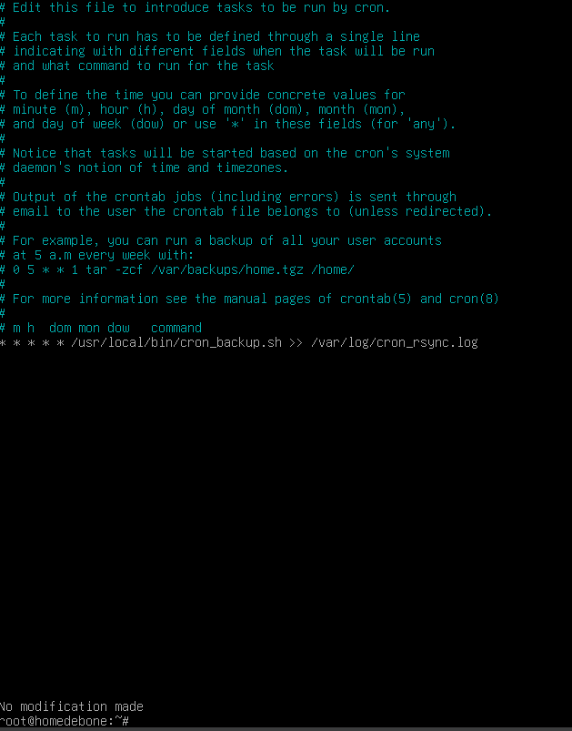
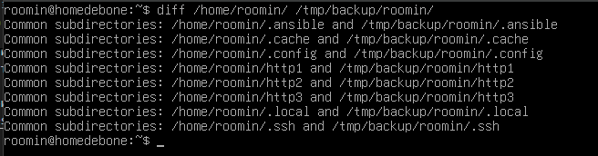

# Домашнее задание к занятию 3 «Резервное копирование» - `Бутко Александр`

### Задание 1
1. Составьте команду rsync, которая позволяет создавать зеркальную копию домашней директории пользователя в директорию /tmp/backup
2. Необходимо исключить из синхронизации все директории, начинающиеся с точки (скрытые)
3. Необходимо сделать так, чтобы rsync подсчитывал хэш-суммы для всех файлов, даже если их время модификации и размер идентичны в источнике и приемнике.
4. На проверку направить скриншот с командой и результатом ее выполнения

 
---

### Задание 2
1. Написать скрипт и настроить задачу на регулярное резервное копирование домашней директории пользователя с помощью rsync и cron.
2. Резервная копия должна быть полностью зеркальной
3. Резервная копия должна создаваться раз в день, в системном логе должна появляться запись об успешном или неуспешном выполнении операции
4. Резервная копия размещается локально, в директории /tmp/backup
5. На проверку направить файл crontab и скриншот с результатом работы утилиты.

#
ХОРОШО ИЛИ НЕ ХОРОШО ПЕРЕНАПРАВЛЯЕТСЯ В ФАЙЛ, настроено по минуте, чтобы раз в день, нужно вместо всех звезд поставить 0 3 * * * раз в день в 3 часа
#

#
КРОНТАБ
#

#
СРАВНЕНИЕ ДИРЕКТОРИЙ
#

---

