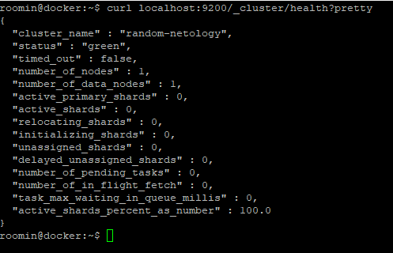
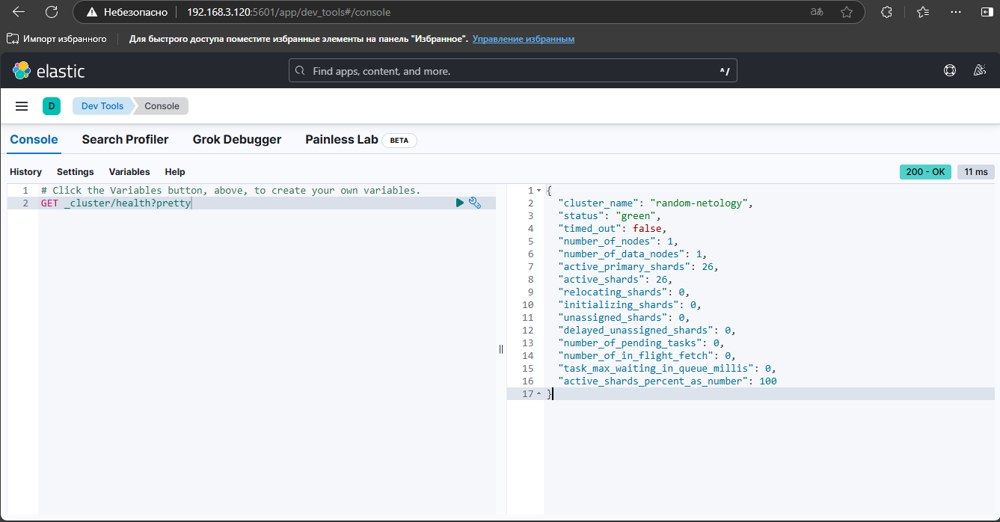
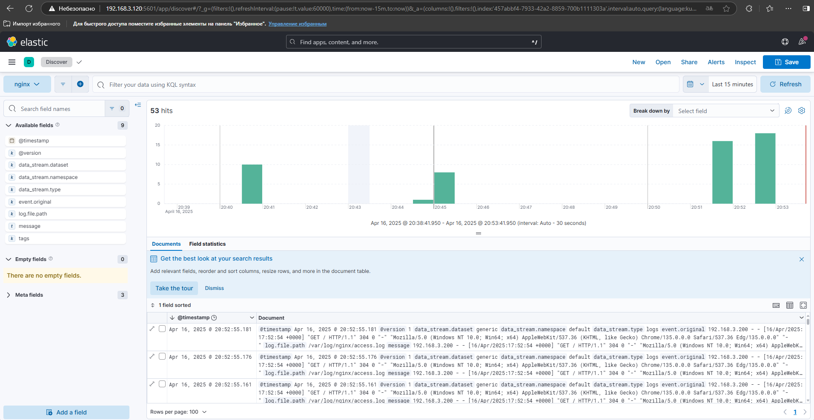
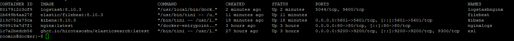
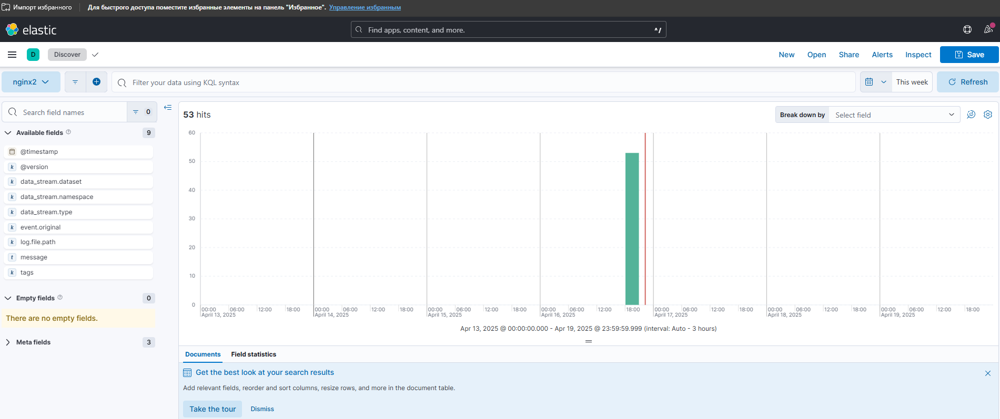

# Домашнее задание к занятию «ELK» - `Бутко Александр`

# Задание 1. Elasticsearch

    Установите и запустите Elasticsearch, после чего поменяйте параметр cluster_name на случайный.

    Приведите скриншот команды 'curl -X GET 'localhost:9200/_cluster/health?pretty', сделанной на сервере с установленным Elasticsearch. Где будет виден нестандартный cluster_name.
---

    docker run --name es1 -p 9200:9200 -e "discovery.type=single-node" -e "xpack.security.enabled=false" -e "cluster.name=random-netology" -it ghcr.io/hirotasoshu/elasticsearch:latest

 

---

# Задание 2. Kibana
    Установите и запустите Kibana.

    Приведите скриншот интерфейса Kibana на странице http://<ip вашего сервера>:5601/app/dev_tools#/console, где будет выполнен запрос GET /_cluster/health?pretty.
---
    docker run -d --name kibana  -p 5601:5601 kibana:8.10.3

 

# Задание 3. Logstash

    Установите и запустите Logstash и Nginx. С помощью Logstash отправьте access-лог Nginx в Elasticsearch.

    Приведите скриншот интерфейса Kibana, на котором видны логи Nginx.
---
    docker run -d --name logstashnginx -v /home/roomin/logs/access.log:/var/log/nginx/access.log -v ./config/logstash.yml:/usr/share/logstash/config/logstash.yml -     
    v./config/pipelines.yml:/usr/share/logstash/config/pipelines.yml -v ./pipelines/nginx_logs.conf:/usr/share/logstash/config/pipelines/nginx_logs.conf logstash:8.10.3

  

# Задание 4. Filebeat.

    Установите и запустите Filebeat. Переключите поставку логов Nginx с Logstash на Filebeat.

    Приведите скриншот интерфейса Kibana, на котором видны логи Nginx, которые были отправлены через Filebeat.

    Дополнительные задания (со звёздочкой*)
---
    docker run -d --name logstashnginx -v /home/roomin/logs/access.log:/var/log/nginx/access.log -v ./config/logstash.yml:/usr/share/logstash/config/logstash.yml - 
    v./config/pipelines_filebeat.yml:/usr/share/logstash/config/pipelines.yml -v ./pipelines/nginx_logs_filebeat.conf:/usr/share/logstash/config/pipelines/nginx_logs_filebeat.conf 
    logstash:8.10.3
    
    docker run -d --name filebeat -v ./logs/access.log:/var/log/nginx/access.log -v ./filebeat/filebeat.yml:/usr/share/filebeat/filebeat.yml elastic/filebeat:8.10.3

 
 

# Задание 5*. Доставка данных

    Настройте поставку лога в Elasticsearch через Logstash и Filebeat любого другого сервиса , но не Nginx. Для этого лог должен писаться на файловую систему, Logstash должен корректно его распарсить и разложить на поля.

    Приведите скриншот интерфейса Kibana, на котором будет виден этот лог и напишите лог какого приложения отправляется.
---

