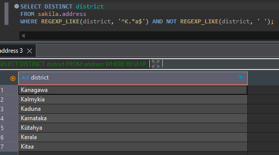
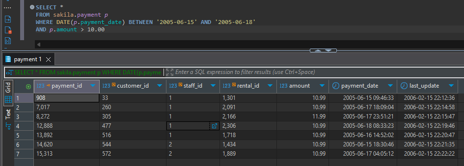
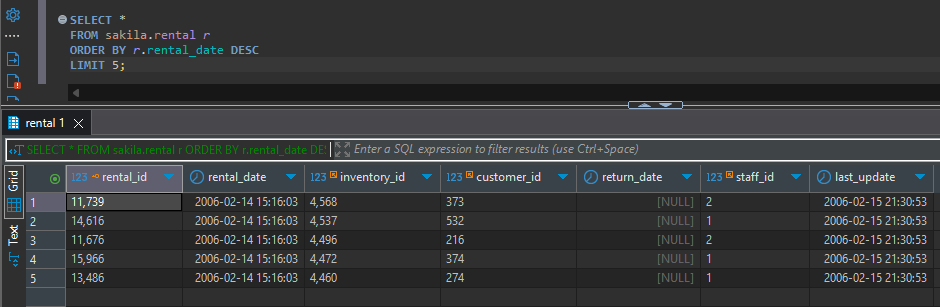
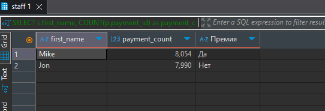
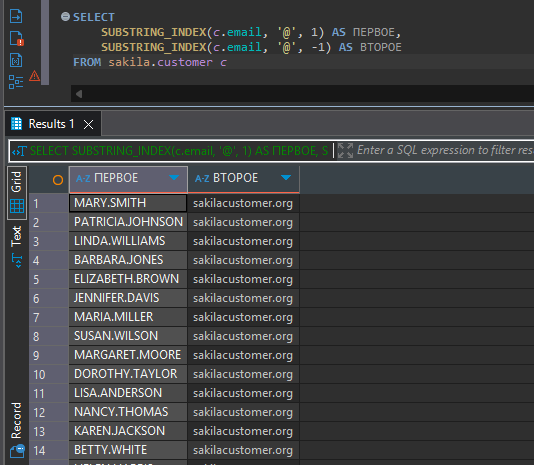

### Домашнее задание к занятию «SQL. Часть 1»

Задание можно выполнить как в любом IDE, так и в командной строке.
---

### Задание 1
---
Получите уникальные названия районов из таблицы с адресами, которые начинаются на “K” и заканчиваются на “a” и не содержат пробелов.


```SQL
SELECT DISTINCT district
FROM sakila.address
WHERE REGEXP_LIKE(district, '^K.*a$') AND NOT REGEXP_LIKE(district, ' ');
```
<center></center>


### Задание 2
---

Получите из таблицы платежей за прокат фильмов информацию по платежам, которые выполнялись в промежуток с 15 июня 2005 года по 18 июня 2005 года включительно и стоимость которых превышает 10.00.
```SQL
SELECT *
FROM sakila.payment p
WHERE DATE(p.payment_date) BETWEEN '2005-06-15' AND '2005-06-18'
AND p.amount > 10.00
```
<center></center>


### Задание 3
---

Получите последние пять аренд фильмов.

```SQL
SELECT *
FROM sakila.rental r 
ORDER BY r.rental_date DESC
LIMIT 5;
```

<center></center>


### Задание 4
---

Одним запросом получите активных покупателей, имена которых Kelly или Willie.

Сформируйте вывод в результат таким образом:

все буквы в фамилии и имени из верхнего регистра переведите в нижний регистр,
замените буквы 'll' в именах на 'pp'.

```SQL
SELECT 
	c.customer_id,
	c.store_id,
	LOWER(REGEXP_REPLACE(c.first_name,'ll', 'pp')),
	LOWER(c.last_name),
	c.email,
	c.address_id,
	c.active,
	c.create_date,
	c.last_update
FROM sakila.customer c
WHERE (c.first_name = 'Kelly' OR c.first_name = 'Willie') AND c.active = 1;
```
<center></center>

---

Дополнительные задания (со звёздочкой*)
Эти задания дополнительные, то есть не обязательные к выполнению, и никак не повлияют на получение вами зачёта по этому домашнему заданию. Вы можете их выполнить, если хотите глубже шире разобраться в материале.

### Задание 5*
---

Выведите Email каждого покупателя, разделив значение Email на две отдельных колонки: в первой колонке должно быть значение, указанное до @, во второй — значение, указанное после @.

```SQL
SELECT 
	SUBSTRING_INDEX(c.email, '@', 1) AS ПЕРВОЕ,
	SUBSTRING_INDEX(c.email, '@', -1) AS ВТОРОЕ
FROM sakila.customer c 
```
<center></center>

### Задание 6*
---

Доработайте запрос из предыдущего задания, скорректируйте значения в новых колонках: первая буква должна быть заглавной, остальные — строчными.

```SQL
SELECT 
	SUBSTRING_INDEX(CONCAT(UPPER(LEFT(c.email,1)), LOWER(SUBSTRING(c.email, 2, CHAR_LENGTH(c.email)))), '@', 1 ) AS ПЕРВОЕ,
	CONCAT(LEFT(UPPER(SUBSTRING_INDEX(c.email, '@', -1)),1), SUBSTRING(LOWER(SUBSTRING_INDEX(c.email, '@', -1)),2)  ) AS ВТОРОЕ
FROM sakila.customer c
```

<center></center>


